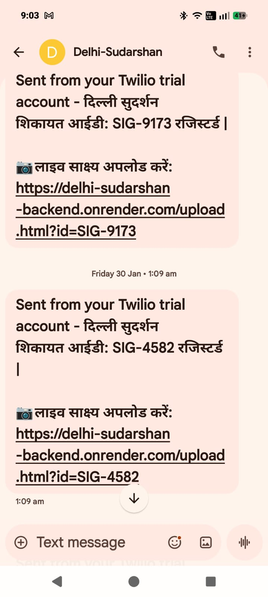

  
  
  # दिल्ली SUDARSHAN | The Future of Governance
  
  **Bridging Voice to Vision — An AI-Powered Civic Command Center**
  
  
  
  

  

    <strong>"We do not force the citizen to learn technology; we force technology to adapt to the citizen."</strong>
  

---

## ❓ What is Delhi Sudarshan? (In Simple Words)

Imagine a grandmother in Delhi who cannot read, write, or use a smartphone app. Today, if she sees a broken street light or garbage pile, she has no easy way to complain. 

**Delhi Sudarshan** changes that. 
It is a **Voice-First AI System** that acts like a helpful government officer.
1.  **She speaks** to our AI (Vaani) in Hindi or English.
2.  **The AI listens**, understands the problem, and files a complaint instantly.
3.  **The Government Dashboard** updates in real-time.
4.  **The AI verifies** if the work is actually done by calling the citizen back.

---

## ⚠️ IMPORTANT: How to Test the Demo (Please Read)

Since this is a **Prototype** running in a **Developer Sandbox Environment**, we have strict security restrictions on sending SMS to prevent spam.

To see the **Live SMS Confirmation**, you must use one of our **Verified Tester Numbers** when the AI asks for your phone number.

### 🔢 Use These Numbers for the Full Experience:
If you speak one of these numbers to the AI, you will receive the live SMS shown below:
1. **+91 78385 29756**
2. **+91 96508 45738**
3. **+91 74192 99176**
4. **+91 78272 14552**

> **Note:** If you use your *own* unregistered number, the AI will still **accept your complaint** and update the dashboard successfully, but you **will not receive the SMS** due to telecom sandbox regulations.

### 📱 Visual Proof: The SMS You Will Receive

  
  
<em>Example of the automated confirmation SMS sent by the system.</em>

---

## 🔗 Live Project Links

| Component | Link | Purpose |
| :--- | :--- | :--- |
| **🗣️ Talk to Vaani (AI Agent)** | [**Click Here to Speak**](https://vaani-khaki.vercel.app) | **Start Here.** Open this on your mobile to file a voice complaint. |
| **💻 Officer Dashboard** | [**View Dashboard**](https://delhi-sudarshan-frontend.vercel.app/) | See how the government views and manages complaints in real-time. |
| **📞 Citizen Audit Call** | [**Trigger Audit Call**](https://delhi-sudarshan-backend.onrender.com/citizen.html) | Simulate the AI calling a citizen to verify if work is done. |

---

## 📖 The User Journey (How it Works)

### Step 1: The Citizen Speaks (Zero-UI)
The user opens the **Vaani** link. They don't need to type anything. They just say:
> *"Namaste, there is a huge pile of garbage in Laxmi Nagar."*

The AI (Gemini 2.5) processes this in **under 0.5 seconds**, extracts the location ("Laxmi Nagar") and category ("MCD/Garbage"), and asks for a phone number.

### Step 2: The System Records
The complaint instantly appears on the **Officer Dashboard**. 
* **Registered Number:** The user gets an instant SMS with a Complaint ID.
* **Unregistered Number:** The complaint is logged on the dashboard (System Logic Works), but SMS is skipped.

### Step 3: The Officer Acts
The Nodal Officer sees the complaint. Instead of manually sorting it, the AI has already assigned it to the correct department (e.g., Sanitation Dept).

### Step 4: The "Audit Loop" (Unique Feature)
This is our magic. When a contractor says "Work Done," the officer clicks **"Audit Cluster"**.
The AI **calls the citizen back** and asks:
> *"The department says your issue is resolved. Is this true? Press 1 for Yes, 2 for No."*

If the citizen says "No," the complaint automatically re-opens. This ensures no fake resolutions.

---

## ✨ Why is this Special?

### 1. 🎙️ Zero-UI Accessibility
Most apps are for the top 50% of educated people. Our system is for the **47% who are elderly or cannot read**. If you can speak, you can use Delhi Sudarshan.

### 2. ✅ The "Citizen Feedback Loop"
We don't just take complaints; we verify them. By automating the feedback call, we stop corruption where contractors claim work is done without actually doing it.

### 3. 🚇 Legacy Tunneling
We don't ask the government to delete their old computers. Our system sits on top of their old databases (like a tunnel), making it cheap and fast to deploy.

### 4. 🛡️ Human-in-the-Loop
The AI helps, but the Human decides. The AI can accept complaints, but only a Human Officer can reject them. This prevents AI errors from hurting citizens.

---

## 🛠️ Technology Stack

* **Frontend:** HTML5, CSS3 (Glassmorphism), JavaScript
* **Backend:** Node.js, Express.js (Stateless Middleware)
* **AI Brain:** Google Gemini 2.5 Flash (Native Audio Processing)
* **Telephony:** Twilio Voice SDK & SMS
* **Deployment:** GitHub Pages + Render + Vercel

---

  
<em>Giving a voice to the unheard. Dedicated to the service of the Nation and the people of Delhi.</em>

  
<strong>"We do not force the citizen to learn technology; we force technology to adapt to the citizen."</strong>

